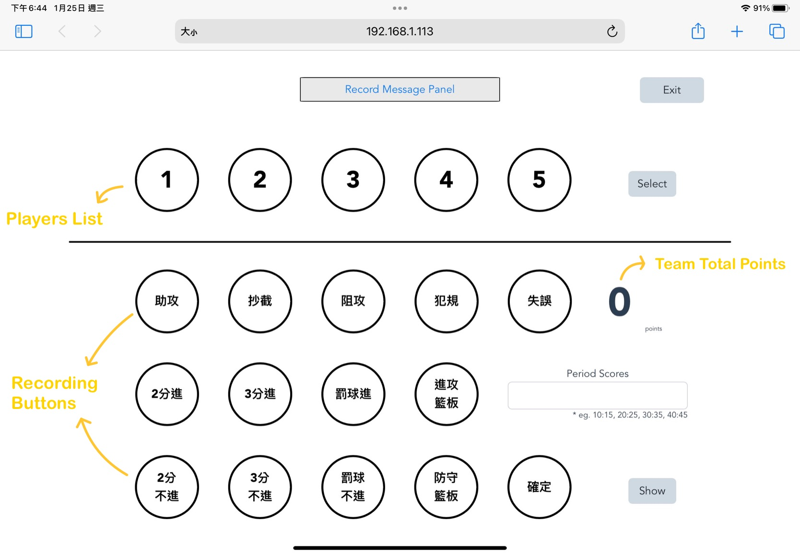

# Basketball_Recoder
This is a web side project for a [basketball recorder](https://mars3397.github.io/Basketball_Recorder/).
The website is deployed on GitHub pages. 

 

> Recommand to use iPad for better user experience. 

 

## Tutorial
- [Web_practice](https://github.com/Mars3397/Web_practice) repository records all my practices of web related topic, 
including `vue2`, `vue3`, `HTML`, `JavaScript`, `CSS`, `Bootstrap5` and `Git`. 
- I use `vue` as main structure of Basketball Recorder. 
- Here is the [Notion Note](https://foregoing-antimatter-0d6.notion.site/Github-Page-b92cdabfb3a44874b33e67882f93daa5) about how to deploy a vue project on GitHub repository with GitHub pages.

 

## User Guide of Basketball Recorder

### Overview
1. Fill up game information. 
2. Select the players. 
3. Select player and corresponding record, then click Confirm.  

### Home page
1. Fill up the information about the game you are going to record.
2. Click **Create** to enter recording page. 

### Recording page
- **Message Panel**: Message panel will show up the **newest record message**. You can see the **recording history** message by clicking message pannel. You can select the records in history and click delete button to **delete records** that are recorded wrong. 
- **Exit Button**: Exit the recording page when the game finished. 
- **Players list**: Choose which player you are going to record. You can click the select button next to players list to switch players. 
- **Recording buttons**: Choose which record type you are going to record. Remember to click Confirm after selecting the player and the record type. 
- **Period Scores**: The text area is used to record 2 team's score of each period. The value will be shown in show button. 
- **Show Button**: Show up the records for each player who has played in this game, as well as the game information. 

### Preview
